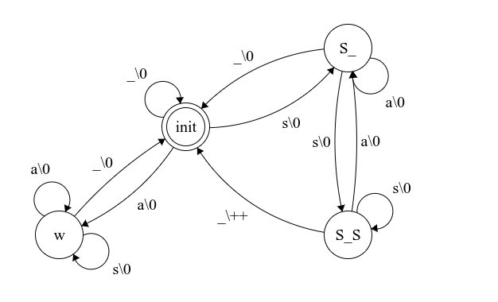

# Использование конечно автоматных методов при тестировании
Выполнил Хафизов Хасан

## Введение
В этой лабораторной работе для некоторой системы строится автоматное описание и её программная реализация. Далее, используя автоматное описание строятся тестовые последовательности, которые подаются на вход программной реализации, таким образом доказывается корректность реализации. Далее с помощью мутационного тестирования оценивается полнота тестирования.

## Неформально описание системы
Необходимо подсчитать количество слов в некотором английском тексте, начинающихся и заканчивающихся на "s"

1. Система считывает текст посимвольно, считая пробел отдельным символом
2. Все знаки кроме "s" и пробела считаются равнозначными
3. При обнаружении подходящего слова автомат возвращает команду "+1"


## Описание програмной реализации
Программа реализована на языке С. Полный листинг реализации можно найти по ссылке https://github.com/xozzslip/fsm-lab. Здесь опишем только общую структуру:

```c
// 4 возможных состояния
enum State {
    INIT, // начальное состояние
    S_, // в начале текущего слова была "s"
    S_S, // в текущем слове найдена вторая "s"
    W // текущее слово не начиналось с "s"
};
```
```c
int count(char *text) {
    enum State state = INIT
    char current;
    int counter = 0;;
    while (1) {
        current = *text++; // текущий символ
        switch(state){
            case INIT:
                // ...
            case S_:
                // ...
            case S_S:
                // ...
            case W:
                // ...
        }
        if (current == '\0')
            break;
    }
    return counter; // количество искомых слов
}
```
## Автоматное описание системы



## Тестирование програмной реализации

По автоматному описанию были построены следующие тестовые последовательности:

ID | input | output
--- | --- | ---
0 | "sss " | 1
1 | "ss ss " | 2
2 | "ss s " | 1
3 | "ss  " | 1
4 | "ssqs " | 1
5 | "ssl " | 0
6 | "s ss " | 1
7 | "s s " | 0
8 | "s  " | 0
9 | "sms " | 1
10 | "sn " | 0
11 | " ss " | 1
12 | " s " | 0
13 | "  " | 0
14 | "qsss " | 0
15 | "lss " | 0
16 | "ns " | 0
17 | "q ss " | 1
18 | "q s " | 0
19 | "q  " | 0
20 | "qqss " | 0
21 | "qqs " | 0
22 | "qq " | 0

Программная реализация успешно проходит юнит-тесты составленные из приведённых выше тестовых последовательностей. 


## Процедура генерации мутантов
Мутанты генерируются с помощью библиотеки https://github.com/mull-project/mull. 

Примеры мутантов:

* Negate mutator 1
  
```c
if (current == '\0') // replaced == with != (32->33)
```

* Negate mutator 2

```c
else if(current == ' ' || current == '\0') { // replaced == with != (32->33)
```

* Math add mutator

```c
counter++; // Math Add: replaced + with -
```

## Оценка полноты тестов
Всего было построено 14 типов мутантов, выпишем отношение количества убитых мутантов к их общему количеству тестов для каждого типа.

ID | killed | score
--- | --- | ---
count_0_22_2_math_add_mutator | 9/23 | 39%
count_0_2_2_negate_mutator | 14/23 | 61%
count_0_4_2_negate_mutator | 5/23 | 21%
count_0_5_2_negate_mutator | 3/23 | 13%
count_0_10_2_negate_mutator | 7/23 | 30%
count_0_12_2_negate_mutator | 2/23 | 9%
count_0_12_2_negate_mutator | 1/23 | 4%
count_0_18_2_negate_mutator | 9/23 | 39%
count_0_20_2_negate_mutator | 9/23 | 39%
count_0_21_2_negate_mutator | 1/23 | 4%
count_0_26_2_negate_mutator | 1/23 | 4%
count_0_28_2_negate_mutator | 2/23 | 9%
count_0_29_2_negate_mutator | 1/23 | 4%
count_0_34_2_negate_mutator | 9/23 | 39%

Все типы мутантов не проходят хотя бы один тест, отсюда можно сделать вывод, что полнота сгенерированных тестов достаточно высока.

## Вывод
Программная реализация системы успешно проходит набор тестов, пораждённый автоматным описанием системы. Набор тестов, в свою очередь, обладает свойством полноты. Два эти свойства позволяют утверждать, что программная реализация корректна.